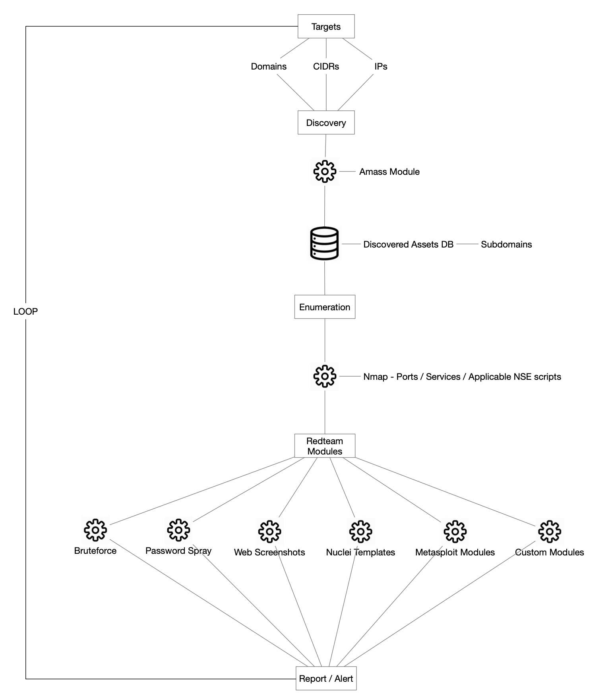
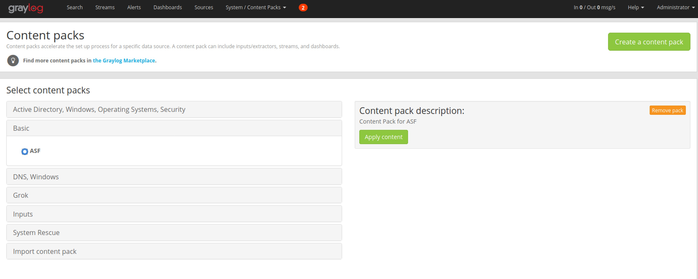
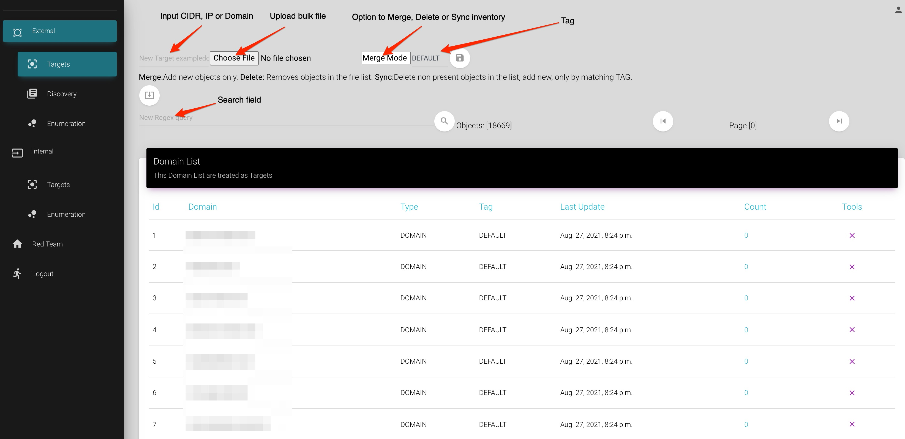
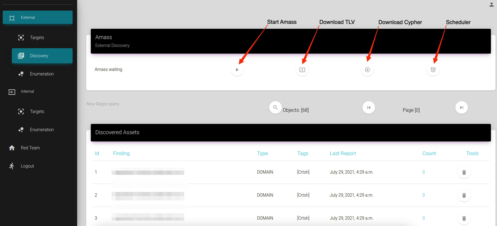
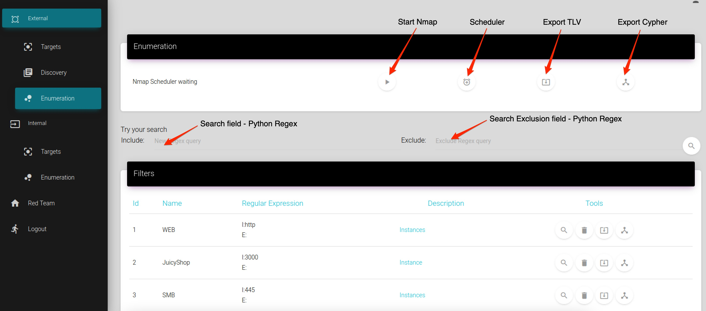

# Attack Surface Framework 

## Overview

ASF aims to protect organizations acting as an attack surface watchdog, provided an “Object” which might be a: Domain, IP address or CIDR (Internal or External), ASF will discover assets/subdomains, enumerate their ports and services, track deltas and serve as a continuous and flexible attacking and alerting framework leveraging an additional layer of support against 0 day vulnerabilities with publicly available POCs.

## Motivation

The lack of support and flexibility to automate discovery of dynamic assets and their associated vulnerabilities through continuous scanning or exploitation in a single pane of glass was the driving force in the creation of ASF, the current solutions are restricted by the technology or the program they are built for, we wanted a solution that is scalable as well as utilizes popular Open Source security tools for handling a full vulnerability lifecycle.

ASF is a breed of open source projects leveraging a powerful arsenal of tools wrapped in a single pane of glass on top of a GUI. ASF architectural diagram illustrated below:

### Prerequisites

Latest version of Kali Linux (tested on 64 bits) - https://kali.org/get-kali/

16 GB of RAM at least

1 TB HD - XFS filesystem recommended

### Build & Run

As root

1. `git clone https://github.com/vmware-labs/attack-surface-framework.git /opt/asf`
2. `cd /opt/asf/`
3. Run `./setup.sh`
4. Assign youruser, email and yourpass

Once the installation is completed

5. `cd /opt/asf/frontend/asfgui/`
6. `. bin/activate`
7. `python3 manage.py runserver 0.0.0.0:8080` - We recommend to run it on a screen session to leave server persistent (`screen -S asf`)

### Security

ASF is not meant to be publicly exposed, assuming you install it on a cloud provider or even on a local instance, we recommend to access it using port forwarding through SSH, here is an example:

`ssh -i "key.pem" -L 8080:127.0.0.1:8080 user@yourhost` - For ASF GUI

`ssh -i "key.pem" -L 9045:127.0.0.1:9045 user@yourhost` - To access Graylog2 Panel

Then open your browser and go to: 

`http://127.0.0.1:8080` - For ASF - user:youruser pass:yourpass (provided in initial setup)

`https://127.0.0.1:9045` - For Graylog2 - user:admin pass:admin #Change it in /graylog/docker-compose.yaml

Graylog2 requires a few steps to start receiving logs from ASF: 

Once logged in, go to System/"Content Packs" and import the Content Pack located at /opt/asf/tools/graylog/content_pack_ASF.json, click on the "Upload" button and you should see "Basic" reflected in the "Select Content Packs" section, click on "Basic", make sure the "ASF" radio button is selected and hit the "Apply content" button, this will create the Global input to parse JSON logs and related extractors. 

Now you are ready to receive logs from ASF and setup your streams / alerts / dasboards ! 

More info @ https://docs.graylog.org/en/4.1/ 

### Documentation

ASF has two scopes:

A) External: For your publicly exposed assets.

B) Internal: Assets in your corporate network.

For the External scope, the flow goes through four basic steps: 

A.1 Targets - Here is where you input your targets

A.2 Discovery - Module that runs the Amass process to discover publicly exposed assets, feel free to create your configuration file to setup your API keys https://github.com/OWASP/Amass/blob/master/examples/config.ini

A.3 Enumeration - Module that runs the NMAP process to enumerate ports/services and create filters for the Redteam module. Default setup is to look for `--top-ports 200` but you can suit it to your needs in /opt/asf/tools/nmap/*.sh

A.4 Redteam - Module that runs submodules located in "/opt/asf/redteam"

Note: For the Internal scope, the flow goes through A.1(Targets),A.3(Enumeration) and A.4(Redteam). 

### Contributing

The attack-surface-framework project team welcomes contributions from the community. Before you start working with attack-surface-framework, please
read our [Developer Certificate of Origin](https://cla.vmware.com/dco). All contributions to this repository must be
signed as described on that page. Your signature certifies that you wrote the patch or have the right to pass it on
as an open-source patch. For more detailed information, refer to [CONTRIBUTING.md](CONTRIBUTING.md).

### License

Attack Surface Framework the BSD-2 license (the "License") set forth below applies to all parts of the Attack Surface Framework project. You may not use this file except in compliance with the License.

BSD-2 License

Redistribution and use in source and binary forms, with or without modification, are permitted provided that the following conditions are met:

Redistributions of source code must retain the above copyright notice, this list of conditions and the following disclaimer.

Redistributions in binary form must reproduce the above copyright notice, this list of conditions and the following disclaimer in the documentation and/or other materials provided with the distribution.

THIS SOFTWARE IS PROVIDED BY THE COPYRIGHT HOLDERS AND CONTRIBUTORS "AS IS" AND ANY EXPRESS OR IMPLIED WARRANTIES, INCLUDING, BUT NOT LIMITED TO, THE IMPLIED WARRANTIES OF MERCHANTABILITY AND FITNESS FOR A PARTICULAR PURPOSE ARE DISCLAIMED. IN NO EVENT SHALL THE COPYRIGHT HOLDER OR CONTRIBUTORS BE LIABLE FOR ANY DIRECT, INDIRECT, INCIDENTAL, SPECIAL, EXEMPLARY, OR CONSEQUENTIAL DAMAGES (INCLUDING, BUT NOT LIMITED TO, PROCUREMENT OF SUBSTITUTE GOODS OR SERVICES; LOSS OF USE, DATA, OR PROFITS; OR BUSINESS INTERRUPTION) HOWEVER CAUSED AND ON ANY THEORY OF LIABILITY, WHETHER IN CONTRACT, STRICT LIABILITY, OR TORT (INCLUDING NEGLIGENCE OR OTHERWISE) ARISING IN ANY WAY OUT OF THE USE OF THIS SOFTWARE, EVEN IF ADVISED OF THE POSSIBILITY OF SUCH DAMAGE.

### Credits

https://www.djangoproject.com/

https://github.com/creativetimofficial/material-dashboard-django

https://nmap.org/

https://danielmiessler.com/study/amass/

https://github.com/lanjelot/patator

https://github.com/FortyNorthSecurity/EyeWitness

https://github.com/projectdiscovery/nuclei

https://www.metasploit.com

https://www.kalilinux.org

https://www.graylog.org/products/open-source

https://github.com/wpscanteam/wpscan
